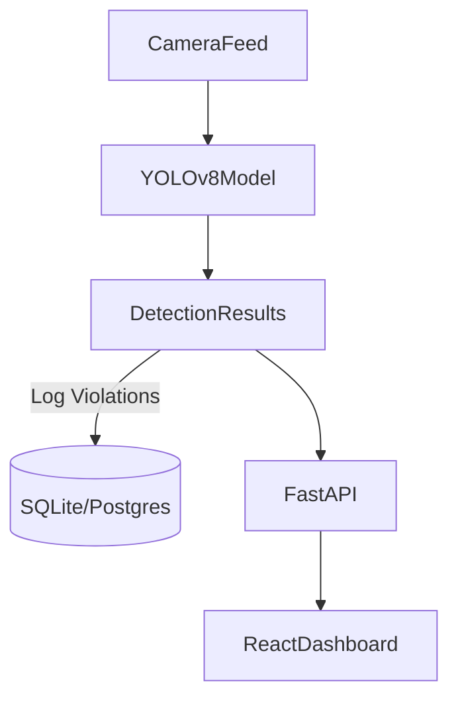

# 🛡️ Real-Time Security Compliance Detector

>An AI-powered surveillance system for banks and secure facilities, detecting masks, helmets, coats, and jackets in real time from live camera feeds.

Built with **YOLOv8 (Python)**, **FastAPI backend**, and a **React dashboard**. Combines computer vision, modern web development, and real-world security compliance.

---

## 🚀 Features

- 🎥 **Real-Time Detection:** YOLOv8 identifies masks, helmets, coats, and jackets from webcam/CCTV feeds.
- 📊 **Modern Dashboard:** Interactive React + Tailwind + shadcn UI dashboard for live monitoring.
- 📝 **Violation Logging:** Logs each violation with timestamp, category, and snapshot.
- 🔔 **Alerts:** Real-time warnings for unauthorized attire (pop-ups, optional sound).
- 📂 **Snapshot Gallery:** Store and review captured violation images.
- 📈 **Analytics:** Visual reports of daily, weekly, and monthly violations.

---

## 🏗️ Tech Stack

### Computer Vision & Backend

- [Python](https://www.python.org/)
- [YOLOv8](https://github.com/ultralytics/ultralytics) — Object detection
- [OpenCV](https://opencv.org/) — Video processing
- [FastAPI](https://fastapi.tiangolo.com/) — REST API backend
- [SQLite/PostgreSQL](https://www.sqlite.org/) — Violation logging

### Frontend Dashboard

- [React](https://react.dev/) — UI
- [TailwindCSS](https://tailwindcss.com/) — Styling
- [shadcn/ui](https://ui.shadcn.com/) — Modern components
- [Recharts](https://recharts.org/) — Analytics & graphs

---

## ⚙️ System Architecture



---

## 📂 Project Structure (Planned)

```text
security-compliance-detector/
│
├── backend/                # FastAPI + YOLOv8 + SQLite
│   ├── main.py             # API entry point
│   ├── detection.py        # YOLOv8 model inference
│   ├── database.py         # Violation logging
│   └── requirements.txt
│
├── frontend/               # React + Tailwind + shadcn UI
│   ├── src/
│   │   ├── components/     # Reusable UI components
│   │   ├── pages/          # Dashboard pages
│   │   └── App.tsx
│   └── package.json
│
└── README.md
```

---

## 🎯 Use Case Scenario

**🔒 Bank Security Example:**

- Detects if visitors wear masks, helmets, or jackets in restricted areas.
- Logs a violation with snapshot and timestamp.
- Alerts security staff in real time via the dashboard.
- Prevents identity concealment and enhances security compliance.

---

## 🚦 Roadmap

1. Set up YOLOv8 detection in Python
2. Build FastAPI backend for detections and logging
3. Develop React dashboard (live feed, logs, charts)
4. Add real-time alerts (UI notifications, sound)
5. Polish UI with shadcn components
6. Add multi-camera support

---

## 🤝 Contributing

Pull requests are welcome! For major changes, please open an issue first to discuss what you’d like to change.

---

## 📄 License

This project is for educational and portfolio purposes. Not intended for commercial deployment.

---